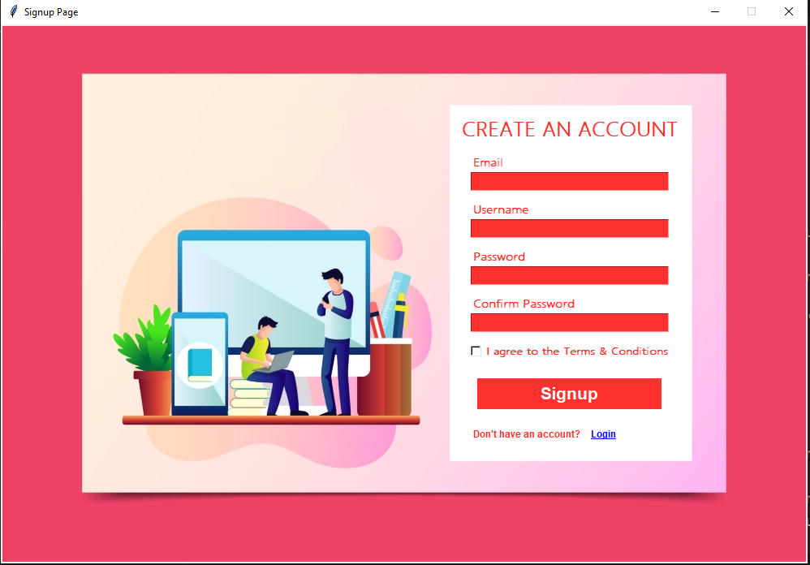
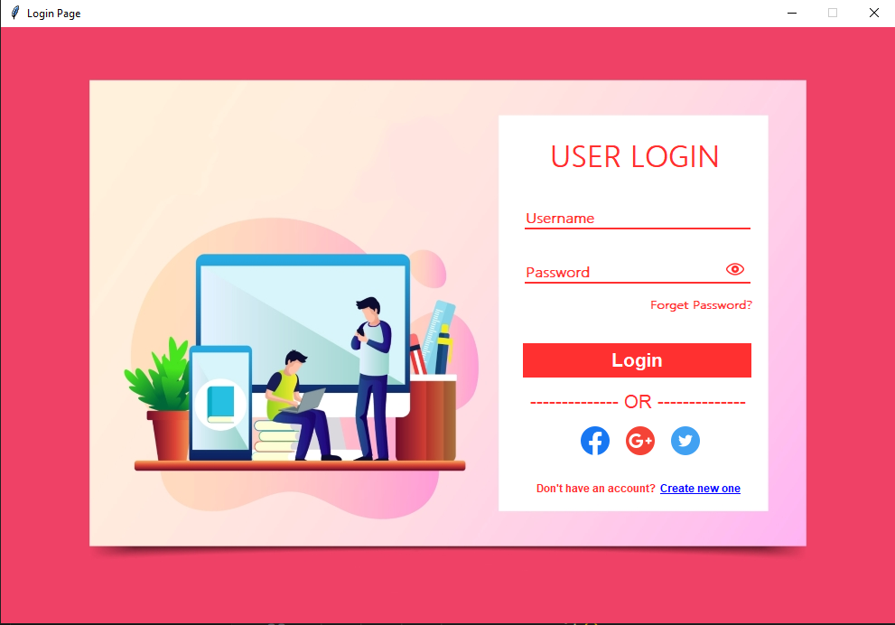
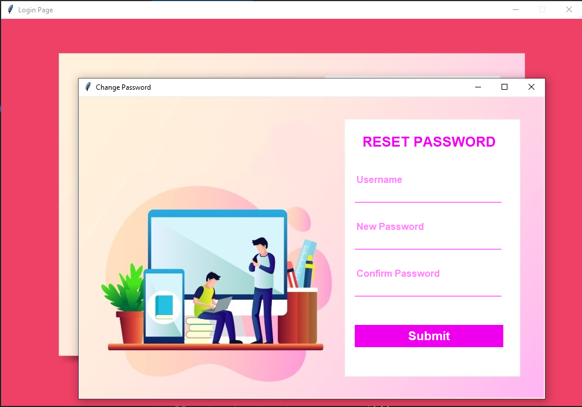

Sure! Here's a professional, detailed, and engaging `README.md` file for your Tkinter login/signup project that includes emojis and a section for your screenshots.

---

# 🗝️ Tkinter User Authentication System

Welcome to the **Tkinter User Authentication System** — a simple yet powerful Python application for user registration, login, and password reset functionalities, integrated with a MySQL database.
Built with Tkinter GUI, PIL for images, and PyMySQL for database operations.

---

## 🚀 Features

* **User Signup:** Register new users with email, username, and password, including password confirmation and terms & conditions acceptance.
* **User Login:** Secure login system validating username and password against the MySQL database.
* **Password Reset:** "Forget Password" feature allowing users to reset their password by entering their username.
* **Password Visibility Toggle:** Show/hide password on the login screen with a friendly eye icon.
* **Database Integration:** Automatic database and table creation if they don’t exist.
* **Input Validation:** Checks for empty fields, password confirmation, and username uniqueness.
* **Error Handling:** Friendly error messages for incorrect inputs or database connectivity issues.
* **Beautiful UI:** Clean and modern interface with custom background images and icons.

---

## 🛠️ Technologies Used

* Python 3.x
* Tkinter (for GUI)
* Pillow (PIL) (for image handling)
* PyMySQL (for MySQL database connectivity)
* MySQL Server (local host)

---

## 📸 Screenshots

| Signup Page                            | Login Page                           | Password Reset Window                             |
| -------------------------------------- | ------------------------------------ | ------------------------------------------------- |
|  |  |  |

*Add your actual screenshots in the `screenshots` folder.*

---

## 🔧 How to Run

1. **Clone the repository:**

   ```bash
   git clone https://github.com/mian-arham-haroon/arham_portfolio.git
   cd your-project-folder
   ```

2. **Install dependencies:**

   Make sure you have Python and MySQL installed on your system.

   ```bash
   pip install pillow pymysql
   ```

3. **Setup MySQL:**

   * Ensure MySQL server is running on your machine.
   * The app uses MySQL user `'root'` and password `'----------'` (change in the code if needed).
   * The database `userdata` and table `data` will be created automatically.

4. **Run the application:**

   ```bash
   python signin.py
   ```

---

## ⚠️ Important Security Note

**⚠️ Do NOT expose your database password or any credentials publicly (e.g., on GitHub).**
For production, store credentials securely using environment variables or config files excluded from version control.

---

## 📝 Code Overview

* `signin.py` — Contains the **login window** code with password toggle, database validation, and login authentication.
* `signup.py` — Contains the **signup window** with registration form and database insertion logic.
* `forget_pass.py` — Contains the **password reset** window for resetting forgotten passwords.

---

## 🤝 Contribution

Feel free to open issues or submit pull requests to improve the app!
Your feedback and support are appreciated. 💙

---

## 📫 Contact

**Mian Arham Haroon**
[GitHub Profile](https://github.com/mian-arham-haroon) | [Portfolio](https://mian-arham-haroon.github.io/arham_portfolio/)

---

Thank you for checking out this project! 🙌

---

Would you like me to help you prepare the screenshots folder structure or give tips on how to manage your database credentials safely?
## License
This project is licensed under the MIT License. See the [LICENSE](LICENSE) file for details.
